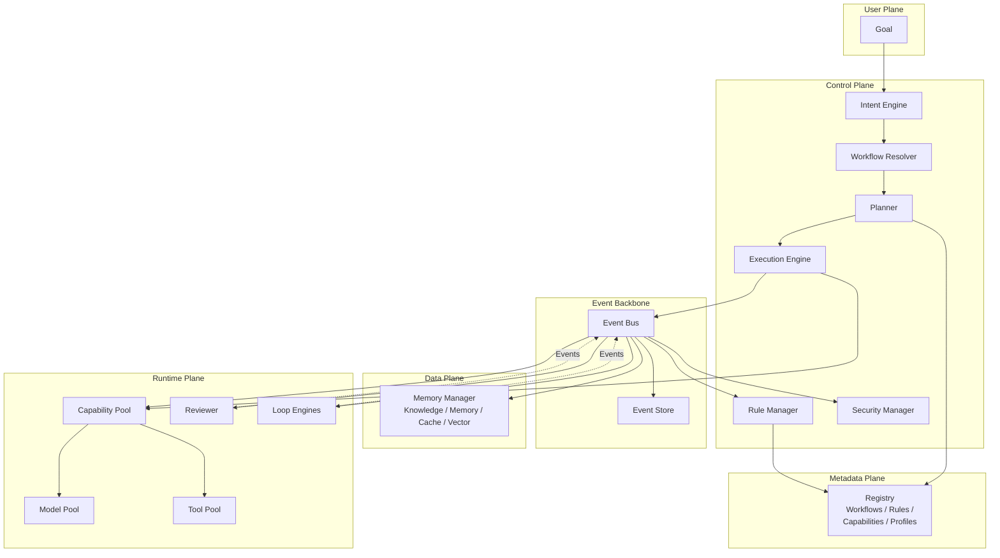

# Agent OS

**An AI-native operating platform specification and reference runtime for building composable, governed, and observable AI systems.**

Agent OS is not an AI. It is the operating system that manages all AIs — a platform where Workflows define method, Tasks define intent, Rules embody domain knowledge, Capabilities provide reusable power, and the Kernel orchestrates everything.



## Project Status

[](https://github.com/X-code-sourse/agent-os/actions/workflows/ci.yml)

**Milestone 0 — Foundation Specification** (complete)

The project is in specification-driven development. See [reference/](reference/) for the P1 runtime implementation.

## Documentation

| Layer | Document | Description |
|-------|----------|-------------|
| Vision | [VISION.md](docs/vision/VISION.md) | Why Agent OS exists |
| Philosophy | [PHILOSOPHY.md](docs/vision/PHILOSOPHY.md) | What we believe |
| Constitution | [CONSTITUTION.md](docs/vision/CONSTITUTION.md) | Principles never to violate |
| Specs | [SPEC-INDEX.md](docs/spec/SPEC-INDEX.md) | Core specifications |
| RFCs | [RFC-INDEX.md](docs/rfc/RFC-INDEX.md) | Protocol & module proposals |
| ADRs | [ADR-INDEX.md](docs/adr/ADR-INDEX.md) | Architecture decisions |
| Glossary | [docs/glossary/TERMS.md](docs/glossary/TERMS.md) | Quick term lookup |

## Repository Structure

```
agent-os/
├── docs/             — All specification documents
│   ├── vision/       — VISION, PHILOSOPHY, CONSTITUTION
│   ├── spec/         — Core Specifications (SPEC-0000+)
│   ├── rfc/          — RFC proposals
│   ├── adr/          — Architecture Decision Records
│   └── glossary/     — TERMS.md
├── schemas/          — JSON Schema definitions for all objects
├── examples/         — Reference examples for workflows, rules, capabilities
├── reference/        — Future reference implementation
├── tools/            — Documentation generators, schema validators
└── .github/          — CI, issue templates
```

## License

[Apache 2.0](LICENSE)
