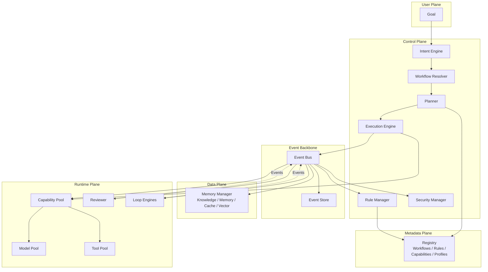

# Agent OS — Architecture

## System Architecture

## Layers

| Plane | Role |
|-------|------|
| **User Plane** | Goal entry point — users state *what*, not *how* |
| **Event Backbone** | Event bus + event store — the system's nervous system |
| **Control Plane** | Intent → Workflow → Plan → Execution. Rules & security enforcement |
| **Metadata Plane** | Registry of all objects — workflows, rules, capabilities, profiles |
| **Data Plane** | Memory, knowledge, cache, and vector storage |
| **Runtime Plane** | Capability pool, model pool, tool pool, reviewer, loop engines |

## Design Principles

Agent OS follows a layered, event-driven architecture where each plane has a well-defined responsibility. The Kernel (Control Plane) manages orchestration without executing any capability itself — capabilities are pluggable and shared across all workflows.

See [CONSTITUTION.md](vision/CONSTITUTION.md) for the full set of architectural principles and [SPEC-0000](spec/SPEC-0000-core-concepts.md) for the object model.
