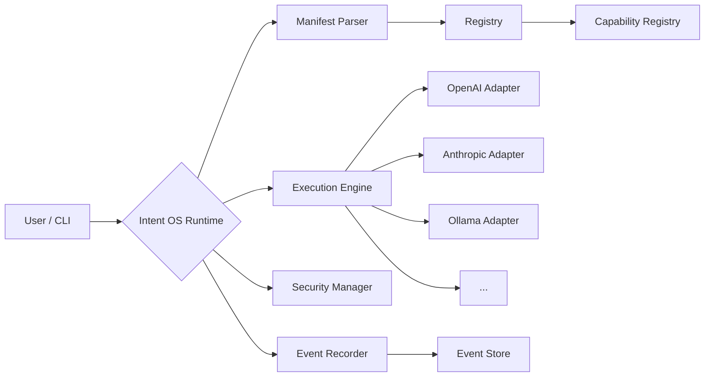

# The flight recorder for AI coding agents.

**See exactly what your AI agent did, why it failed, and how much it cost.** Every model call, every tool invocation, every file change — captured as a structured execution trace.

```bash
pip install intentos
intent-os demo --auto
```

---

## What Intent OS Does

Three things, simply:

:material-file-eye: **Trace** — Record every step your AI agent takes. Model calls, tool invocations, file changes, test runs — all captured.

:material-chart-bar: **Analyze** — See cost, latency, token usage, and failure reasons for every execution. Know why your agent failed.

:material-shield-check: **Govern** — Define security policies that control what agents can do. Audit every action with full compliance reporting.

---

## Quick Demo

Try it — no API key required (Ollama recommended for local execution):

```bash
# Validate a manifest
intent-os validate examples/translate.yaml

# Run a built-in capability by name
intent-os run text_summarize -p text="AI is transforming how we work"

# Compare runtimes
intent-os compare examples/translate.yaml --input '{"text":"hello","target_lang":"fr"}'

# Natural language (requires Ollama or API key)
intent-os ask "translate 'good morning' to Japanese"

# See what's available
intent-os demo --auto
```

---

## How It Works



---

## Why Not Just Use MCP?

[Model Context Protocol](https://modelcontextprotocol.io) standardizes **connection** — how an AI tool talks to a runtime.

Intent OS standardizes **execution** — how a capability is described, composed, discovered, secured, and recorded across runtimes.

They are complementary: Intent OS can consume MCP servers as capability providers.

---

## Project Status

:material-test-tube: **Phase 0: Interoperability Verified** — 689 tests, 8 skipped, 0 failures

The same manifest parses, executes, and produces compatible events across Ollama, OpenAI, and Anthropic runtimes. [See the specs](https://github.com/haihaoxu/intentos/tree/main/specs) for details.

---

## Next Steps

| Step | Action |
|------|--------|
| :material-speedometer: | [Quickstart — 60 seconds to first command](quickstart.md) |
| :material-file-document: | [Learn the Manifest format](guide/manifest.md) |
| :material-book-open-variant: | [Browse the CLI reference](cli/commands.md) |
| :material-github: | [Star the repo](https://github.com/haihaoxu/intentos) |
