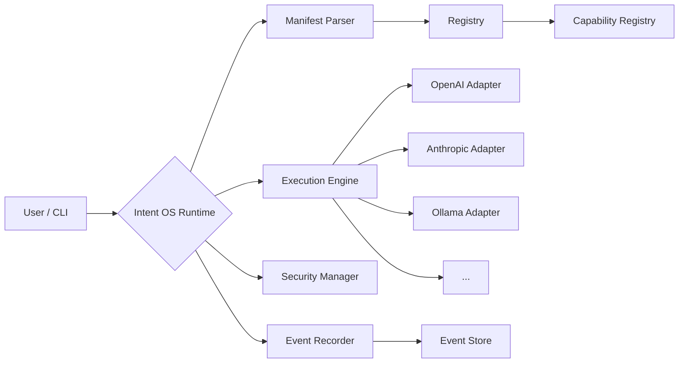

# Your AI capabilities should not be locked into any one company.

**Intent OS is an open interoperability layer for AI capabilities, workflows, and execution.** Write your capability once — run it on any runtime, share it with anyone, and never rewrite for a different platform.

```bash
pip install intent-os
intent-os run translate "Hello world" -p target_lang=zh
# → translated_text: "你好世界"
```

---

## What Intent OS Does

Three things, simply:

:material-file-document: **Describe** — A YAML manifest defines what a capability does, what input it needs, and what output it produces. No vendor-specific SDKs, no platform lock-in.

:material-rocket-launch: **Execute** — Run the same manifest on OpenAI, Anthropic, Ollama, or any compatible runtime. Adapters handle the protocol differences — you just write the manifest once.

:material-magnify: **Discover** — A registry tracks available capabilities. Search by intent ("translate", "code review", "summarize"), find what you need, and reuse it instantly.

---

## Quick Demo

Try it — no API key required (Ollama recommended for local execution):

```bash
# Validate a manifest
intent-os validate examples/translate.yaml

# Run a built-in capability by name
intent-os run text_summarize -p text="AI is transforming how we work"

# Compare runtimes
intent-os compare examples/translate.yaml --input '{"text":"hello","target_lang":"fr"}'

# Natural language (requires Ollama or API key)
intent-os ask "translate 'good morning' to Japanese"

# See what's available
intent-os demo --auto
```

---

## How It Works



---

## Why Not Just Use MCP?

[Model Context Protocol](https://modelcontextprotocol.io) standardizes **connection** — how an AI tool talks to a runtime.

Intent OS standardizes **execution** — how a capability is described, composed, discovered, secured, and recorded across runtimes.

They are complementary: Intent OS can consume MCP servers as capability providers.

---

## Project Status

:material-test-tube: **Phase 0: Interoperability Verified** — 689 tests, 8 skipped, 0 failures

The same manifest parses, executes, and produces compatible events across Ollama, OpenAI, and Anthropic runtimes. [See the specs](https://github.com/X-code-sourse/intentos/tree/main/specs) for details.

---

## Next Steps

| Step | Action |
|------|--------|
| :material-speedometer: | [Quickstart — 60 seconds to first command](quickstart.md) |
| :material-file-document: | [Learn the Manifest format](guide/manifest.md) |
| :material-book-open-variant: | [Browse the CLI reference](cli/commands.md) |
| :material-github: | [Star the repo](https://github.com/X-code-sourse/intentos) |
